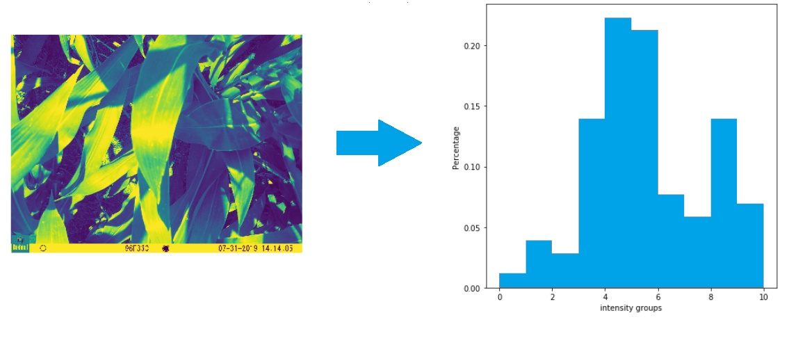
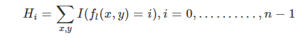
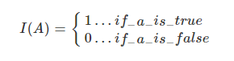
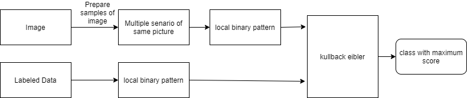

# Object detection using local binary classification 

Developer : Dishan Nahitiya 
Area      : Image analysis

## Objective

Develop an image classifier to identify the nearest class label of canopies based on thier texture intensitivity. 

##  Methodology

 There are number of image classification algorithm in the computer field of image analysis. I will make this project as an opportunity to explore about local binary pattern search , an efficient texture analysis method which is widely used in the areas of
 - facial recognition 
 - face detection
 - verication purposed of the facial images  

## What is local binary pattern search ?

Local binary search is a texture based classification algorithm which generates a pattern sequence. This technique uses a 3 * 3 binary grid which traverse through all pixel and use and calculate
threshholding arround the center pixel and generate a 8 bit number.LBP operator is then applied on the image to extract local features represented by histogram.

  
  
Figure 1. lbp transformation

 
 

  
  
Figure 2. Histogram equation

Inorder to identify the similarities between histograms generated by image, the 
model needs a distant classifier. This project uses  Kullback Leibler divergence 
which has the ability to identify the probability distributions in histograms.
 

 
  
Figure 3. Kullback Leibler divergence identification .

 This algorithm provides the information lost in the mapping process  and  greater the loss resembels dissimilarity between the distributions.

## Challanges
  - When analysing images , due to various reason such as noise, brightness, shape difference, orientation difference and etc, the models might not be able to identify divergense in histograms. As a solutiuon I tried images using data augmentation algorithms. 
 This would give the ability to create different senario of each image and identify the texture similarities in the pictures. 
  - Local binary pattern operates in 2 x 2 dimention forcing to change the image to gray scale pattern. Unfortunetly this process
  will reduce the accuracy in understanding correct cluster. 

## Sketch 

  
   
Figure 4. Project flow.

  
## Results and Discussion 

 - The labels,I aquired for this project are contaminated due to having 2 or more classes in the same image. Therefore the modler will falsely identify the wrong classes.
   but having same kind of texture. 
 - Rotation was needed to identify the differences because the 
 - Since  Kullback Leibler divergence is not a highend distant classifier it has the ability to produce false output.
   inorder get a proper classification it better use a classifier such as support vector machines, k-means and etc. 
   Moreover in modern day deep nural networks has the ability to identify object much accurately.
 
## Conclusion 

 - Hard to identify the intensities due to unorthodox shapes of each plants and number of leaf cpunt variation in an image. 
 - Need to gather more data to identy sharp edges.  
 - It was easy to identify flat areas in a image.
 - When there's increase of radius it will increase the divergense value, which can Identify as more acceptable out come. 
 
## Future work
 - Try to adopt otsu method to isolate dense areas. 
 - I already started working with svm and cnn networks. Need some fine tuning in those project which I believe that I could get more accurate results in classifying crop medels. 
## References

1.[Vupputuri, A. and Meher, S., 2015, April. Facial expression recognition using local binary patterns and kullback leibler divergence. In 2015 International Conference on Communications and Signal Processing (ICCSP) (pp. 0349-0353). IEEE.](https://ieeexplore.ieee.org/document/7322904)

2.[Scikit-image.org. 2020. Local Binary Pattern For Texture Classification — Skimage V0.17.Dev0 Docs. [online] Available at: <https://scikit-image.org/docs/dev/auto_examples/features_detection/plot_local_binary_pattern.html>.](https://scikit-image.org/docs/dev/auto_examples/features_detection/plot_local_binary_pattern.html)

3.[kaggle.com. (n.d.). Image manipulation / augmentation with skimage. [online] Available at: https://www.kaggle.com/tomahim/image-manipulation-augmentation-with-skimage](https://www.kaggle.com/tomahim/image-manipulation-augmentation-with-skimage)
